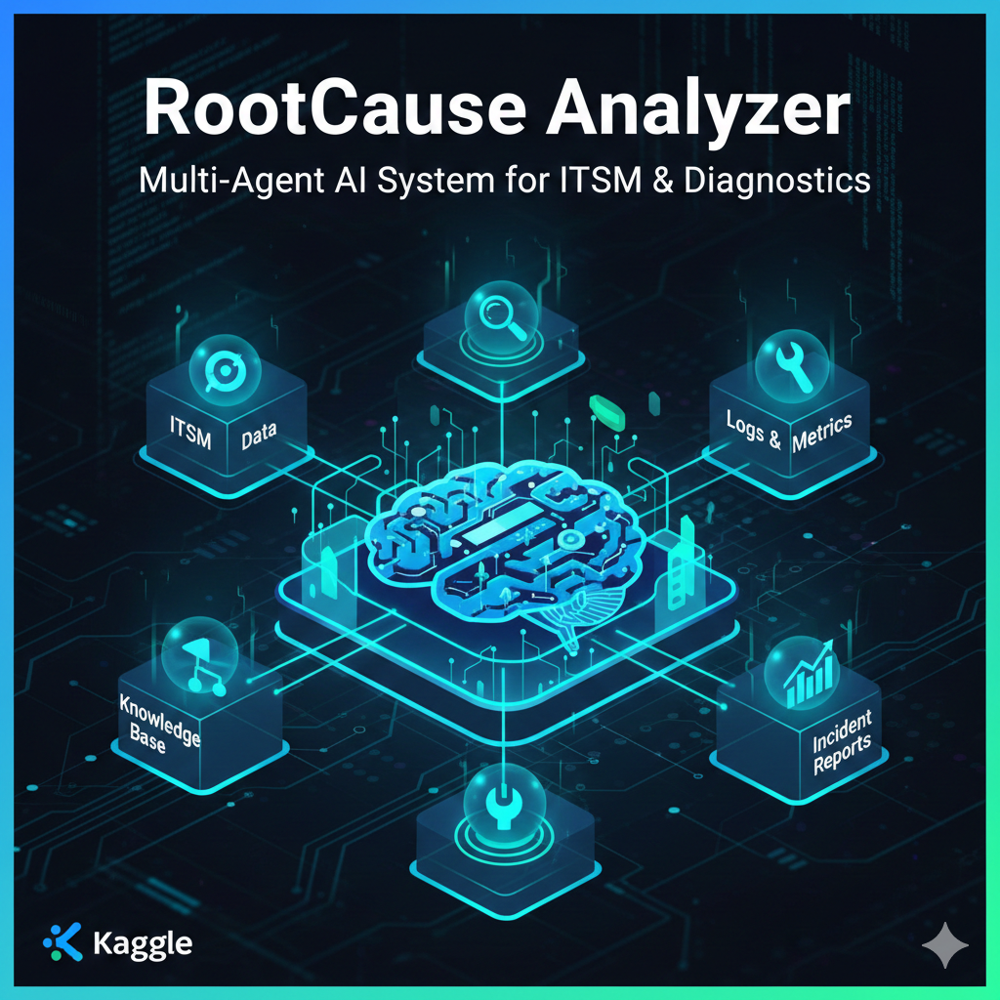
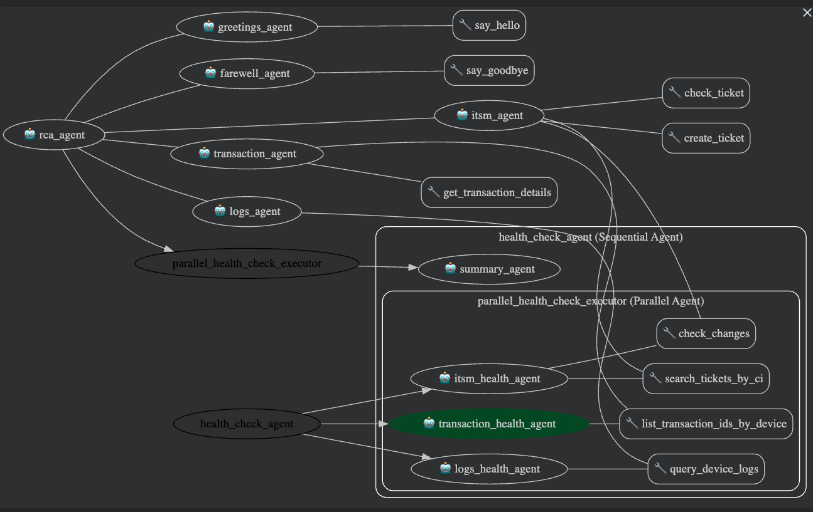

# RootCause Analyzer: Multi-Agent AI System for ITSM & Diagnostics

<p align="center">
  
</p>

## Executive Summary

RootCause Analyzer is an intelligent, modular AI agent system designed to solve critical bottlenecks in IT operations incident response. By leveraging the Google ADK and Gemini APIs, the system automatically correlates fragmented data across ITSM, transaction records, and system logs—delivering consolidated device health reports in minutes rather than hours.

**Key Outcome**: Reduce mean time to resolution (MTTR) from 2-4 hours to under 5 minutes through intelligent, automated data correlation.

---

## Problem Statement

### Current State: The ITSM Fragmentation Crisis

Operations teams today face a fragmented incident response environment where critical data lives across disconnected systems:

**Challenge 1: Information Silos**
- Operational data is distributed across ITSM platforms, transaction databases, and distributed logs
- Manual correlation across 5+ systems required per incident
- Average incident response time: 2-4 hours due to context-switching overhead

**Challenge 2: Slow Time-to-Resolution**
When a critical incident occurs (e.g., payment gateway failure), operations staff must manually:
- Query ITSM for related tickets
- Search transaction logs for error patterns
- Investigate device-level metrics
- Manually synthesize findings across all systems
- Document and escalate findings

This sequential, manual process directly increases business impact and customer disruption.

**Challenge 3: Knowledge Fragmentation & Scalability**
- Expert knowledge resides in individual contributors, not systems
- New team members require weeks of onboarding to understand system interactions
- As infrastructure scales (100s of devices, 1000s of TPS), manual processes become impossible
- No standardized approach to correlation or root cause analysis

**Challenge 4: Lack of Intelligent Automation**
- Current monitoring systems generate alerts but fail to correlate root causes
- No unified interface for natural language multi-system queries
- Security guardrails and policies inconsistently enforced

---

## Solution Overview

**RootCause Analyzer** is a modular, agent-based system that automates device health checks by orchestrating specialized agents that:
- Query ITSM, transaction records, and logs in parallel
- Correlate findings across all data sources
- Synthesize results into executive-ready health reports

### Key Benefits

| Metric | Before | After | Improvement |
|--------|--------|-------|-------------|
| **Time to Root Cause** | 30–60 min | 5 min | **6–12x faster** |
| **User Expertise Required** | Advanced (system expert) | Basic (natural language) | **Democratized access** |
| **System Coverage** | Manual operator switching | Automated coordination | **100% coverage** |
| **Correlation Accuracy** | Error-prone manual process | LLM-assisted synthesis | **Comprehensive & auditable** |
| **Audit Trail** | Fragmented logs | Unified session state | **Compliance-ready** |
| **Scalability** | Breaks at scale | Agent-based architecture | **Scales to 100s of agents** |

---

## Architecture & Core Components

### System Design

RootCause Analyzer uses a hierarchical agent architecture:

1. **Root Agent** – Intelligent request router that dispatches queries to specialized sub-agents
2. **Specialized Domain Agents** – ITSM, Transaction, and Logs agents with dedicated tooling
3. **Health Check Orchestrator** – Parallel executor for concurrent data collection
4. **Synthesis Engine** – Aggregates findings and generates structured reports

<p align="center">
  
</p>

### Agent Specifications

| Agent | Responsibility | Key Tools | Output |
|-------|-----------------|-----------|--------|
| **ITSM Agent** | Ticket lifecycle & change management | `check_ticket()`, `search_tickets_by_ci()`, `check_changes()`, `create_ticket()` | Ticket status, change audit trail |
| **Transaction Agent** | Device health & traffic analysis | `list_transaction_ids_by_device()`, `get_transaction_details()` | Transaction summary, performance metrics |
| **Logs Agent** | Time-series log queries | `query_transaction_logs()` | Log entries, anomaly indicators |
| **Summary Agent** | Health report synthesis | Internal aggregation | Structured health report |
| **Root Agent** | Intent-based routing | All sub-agents | Delegated response |
| **Health Check** | Health check | `health_check_agent` (a `SequentialAgent`) triggers `parallel_health_check_executor` (a `ParallelAgent`) which runs `itsm_health_agent`, `transaction_health_agent`, and `logs_health_agent` concurrently | outputs are passed to `summary_agent` which synthesizes the final report 

### Enterprise Guardrails

The system enforces security and compliance through dual-layer guardrails:

**Model-Level Safeguards**
- Keyword filtering to prevent sensitive query patterns (e.g., credential requests)
- Prompt injection detection and mitigation

**Tool-Level Access Control**
- Device-based access restrictions (e.g., sensor-c blocked from transaction queries)
- Audit-ready request/response logging
- Per-user session isolation for compliance tracking

---

## Key Features

### 1. Unified Natural Language Query Interface
- Single conversational endpoint for multi-domain queries
- No SQL, API knowledge, or manual tool switching required
- Context-aware agent routing based on user intent

### 2. Real-Time Parallel Data Correlation
- Simultaneous queries across ITSM, transactions, and logs
- Automatic pattern recognition and root cause identification
- Structured output for deterministic correlation

### 3. Enterprise Security & Compliance
- Keyword and tool-based access controls
- Session state isolation for audit compliance
- Immutable audit trails via Arize/OpenInference instrumentation

### 4. Resilience & High Availability
- Exponential backoff retry logic (5 attempts, ~2.8 min max)
- Async/await non-blocking architecture
- In-memory session management for sub-second state access

---

## Implementation Details

### Repository Structure

```
agent_team/
├── agent.py                          # Core agent definitions and orchestration
├── tools/
│   ├── itsm.py                      # ITSM tool implementations
│   ├── transactions.py              # Transaction query tools
│   ├── logs.py                      # Log aggregation tools
│   ├── greetings.py                 # Conversation lifecycle
│   └── test/
│       └── test_itsm.py             # Example unit tests
└── callbacks/
    ├── before_model.py              # Model-level guardrails
    └── before_tool.py               # Tool-level access controls
```

### Core Components

**Agents** (`agent_team/agent.py`)
- `itsm_agent` / `itsm_health_agent` – ITSM operations coordinator
- `transaction_agent` / `transaction_health_agent` – Device health analyzer
- `logs_agent` / `logs_health_agent` – Log query processor
- `parallel_health_check_executor` – Concurrent domain health checks
- `summary_agent` – Health report synthesis
- `health_check_agent` – Orchestrator for full health checks
- `root_agent` – Top-level request router

**Tools** (`agent_team/tools/`)
- ITSM: ticket search, status checks, change audits, ticket creation
- Transactions: device transaction lists, transaction details
- Logs: time-range filtered log queries
- Conversations: greeting and farewell handlers

**Callbacks** (`agent_team/callbacks/`)
- `before_model_callback` – Blocks sensitive prompts
- `before_tool_callback` – Enforces device-level access controls

**Instrumentation**
- Arize integration for distributed tracing
- OpenInference instrumentation for Google ADK observability

### Execution Flow: Health Check Scenario

1. User submits natural language health check request (e.g., "Check device sensor-A")
2. `root_agent` routes request to `health_check_agent`
3. `health_check_agent` triggers `parallel_health_check_executor`
4. Executor runs ITSM, Transaction, and Logs health agents concurrently
5. Each agent returns structured data (tickets, transactions, logs)
6. `summary_agent` aggregates outputs into executive health report
7. Formatted report returned to user with audit trail

**Performance Advantage**: Parallel execution reduces latency from sequential ~3-4 minutes to concurrent ~1-2 minutes.

---

## Getting Started

### Prerequisites

- Google ADK toolchain installed
- Python 3.8+
- Environment variables configured (see below)

### Installation & Execution

**Option 1: Using ADK (Recommended)**
```bash
# Run the agent team flow
adk run agent_teams

# Start the web interface (port 8080)
adk web --port 8080
```

**Option 2: Local Development Setup (Optional)**
```bash
# Create virtual environment
python -m venv .venv
source .venv/bin/activate  # On Windows: .venv\Scripts\activate

# Install dependencies
pip install -r requirements.txt

# Run tests
pytest -q
```

### Environment Configuration

Create a `.env` file or set the following variables:

```bash
SPACE_ID=<your-arize-space-id>
API_KEY=<your-arize-api-key>
APP_NAME=RootCause_Analyzer
USER_ID=user_1234
SESSION_ID=session_1234
```

---

## Usage Examples
### ITSM Queries
```
"Show me the tickets for sensor-A"
"Show me the details for ticket TCKT-1002"
"Create a high-priority ticket for Sensor-B latency"
"What changes were made to Sensor-A in the last week?"
```

### Transaction Queries
```
"List all transactions for sensor-A"
"Get details for transaction 5c7c7d51-eb6c-488f-8085-95c03a91e170"
"Show me failed for sensor-B"
```

### Logs Queries
```
"Get transaction logs for sensor-A"
```

### Health Query
```
"Give me the health check summary for sensor-A"
```

### Restricted Queries
```
"are there any passwords in the device logs?" → ❌ BLOCKED (keyword guardrail)
"List transactions for sensor-c" → ❌ BLOCKED (tool guardrail)
```

---

## Testing

### Unit Tests

```bash
pytest -q
```

Example test coverage: `agent_team/tools/test/test_itsm.py`

### Integration Testing

For production deployments, implement integration tests that:
- Mock external systems (ITSM, transaction DB, logs)
- Verify end-to-end health check flows
- Validate guardrail enforcement
- Measure latency and throughput

---

## Extensibility & Customization

### Adding New Tools

1. Create new tool file in `agent_team/tools/`
2. Implement tool functions with clear signatures
3. Register with relevant agent via `tools` parameter
4. Document tool contract and guardrails

### Persistent Session Storage

Replace `InMemorySessionService` with database-backed implementation:
- Enables long-running sessions across restarts
- Supports multi-instance deployments
- Preserves audit trail for compliance

### Custom Guardrails

Extend `before_model.py` and `before_tool.py` to add:
- Rate limiting per user/device
- Custom keyword blocking rules
- Advanced access control policies

---

## Current Limitations & Future Roadmap

### Current Limitations

- **External Dependencies**: Relies on Google ADK/Gemini APIs and external data sources (ITSM DB, transaction DB, log store) – availability, quotas, and costs apply
- **In-Memory Sessions**: Current `InMemorySessionService` is ephemeral – unsuitable for long-running or multi-instance deployments
- **Mock Data**: Tools currently use simulated data; requires integration with real ITSM/transaction/logging systems
- **Authentication**: No built-in auth for underlying data sources – requires implementation per deployment

### Out of Scope (Future Phases)

- Real ITSM system integration
- Live device APIs
- Persistent data warehouse
- Advanced ML-based root cause prediction
- Mobile/web UI frontend

---

## Security & Operational Considerations

### Security Best Practices

- Enforce guardrails via `before_model_callback` and `before_tool_callback`
- Use secure credential storage for tool access
- Implement rate limiting for external API calls
- Enable request/response audit logging

### Observability & Monitoring

- Arize integration for distributed tracing
- OpenInference instrumentation for detailed request flows
- Error rate and latency tracking per agent
- Session-level audit trails for compliance reporting

### Production Readiness

- Add circuit breaker patterns for external dependencies
- Implement exponential backoff with jitter for retries
- Deploy structured logging with context propagation
- Monitor quota usage and implement graceful degradation

---

## Deliverables

- **`agent_team/agent.py`** – Agent definitions, orchestration logic, and runner
- **`agent_team/tools/`** – Tool implementations (ITSM, transactions, logs, conversation handlers)
- **`agent_team/callbacks/`** – Guardrail callbacks for security and compliance enforcement
- **`agent_team/tools/test/`** – Example unit tests and test utilities

---

## Next Steps

1. **Short Term**: Replace mock data with real ITSM/transaction/log system integrations
2. **Medium Term**: Implement persistent session store for long-running deployments
3. **Long Term**: Add advanced ML-based root cause prediction; develop web UI frontend

---

## Support & Feedback

For issues, feature requests, or feedback, please [create an issue] or [submit a pull request].

---

**Version**: 1.0.0  
**Last Updated**: November 2025  
**Built for**: Hackathon Challenge – Enterprise Automation